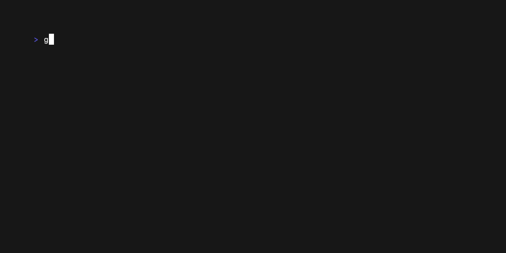
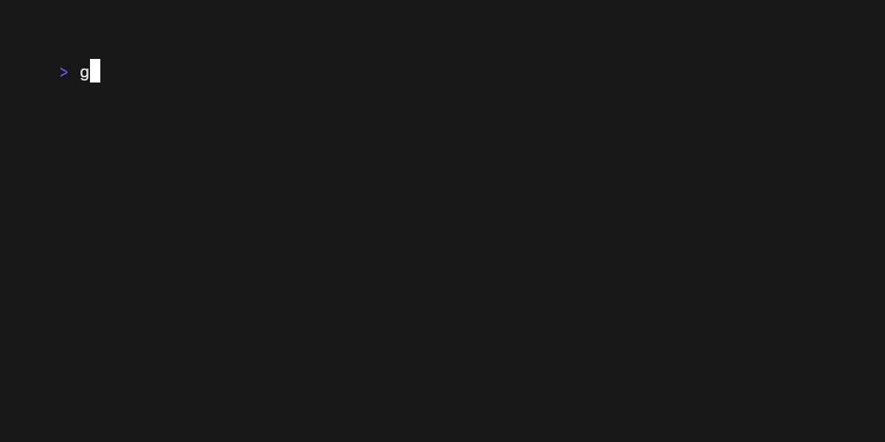

# Examples

### Alt Screen Toggle

The `altscreen-toggle` example shows how to transition between the alternative
screen buffer and the normal screen buffer using Bubble Tea.

### Chat

The `chat` examples shows a basic chat application with a multi-line `textarea`
input.

### Composable Views

The `composable-views` example shows how to compose two bubble models (spinner
and timer) together in a single application and switch between them.

### Credit Card Form

The `credit-card-form` example demonstrates how to build a multi-step form with
`textinput`s bubbles and validation on the inputs.

### Debounce

The `debounce` example shows how to throttle key presses to avoid overloading
your Bubble Tea application.

### Exec

The `exec` example shows how to execute a running command during the execution
of a Bubble Tea application such as launching an `EDITOR`.
 

### Full Screen

The `fullscreen` example shows how to make a Bubble Tea application fullscreen.

### Glamour

The `glamour` example shows how to use [Glamour](https://github.com/charmbracelet/glamour) inside a viewport bubble.

### Help

The `help` example shows how to use the `help` bubble to display help to the
user of your application.

### Http

The `http` example shows how to make an `http` call within your Bubble Tea
application.

### Default List

The `list-default` example shows how to use the list bubble.

### Fancy List

The `list-fancy` example shows how to use the list bubble with extra customizations.

### Simple List

The `list-simple` example shows how to use the list and customize it to have a simpler, more compact, appearance.

### Mouse

The `mouse` example shows how to receive mouse events in a Bubble Tea
application.

<a href="./mouse/main.go">
  Code
</a>

### Package Manager

The `package-manager` example shows how to build an interface for a package
manager using the `tea.Println` feature.

### Pager

The `pager` example shows how to build a simple pager application similar to
`less`.

### Paginator

The `paginator` example shows how to build a simple paginated list.

### Pipe

The `pipe` example demonstrates using shell pipes to communicate with Bubble
Tea applications.

### Animated Progress

The `progress-animated` example shows how to build a progress bar with an
animated progression.

### Download Progress

The `progress-download` example demonstrates how to download a file while
indicating download progress through Bubble Tea.

<a href="./progress-download/main.go">
  Code
</a>

### Static Progress

The `progress-static` example shows a progress bar with static incrementation
of progress.

### Real Time

The `realtime` example demonstrates the use of go channels to perform realtime
communication with a Bubble Tea application.

### Result

The `result` example shows a choice menu with the ability to select an option.

### Send Msg

The `send-msg` example demonstrates the usage of custom `tea.Msg`s.

### Sequence

The `sequence` example demonstrates the `tea.Sequence` command.

### Simple

The `simple` example shows a very simple Bubble Tea application.

### Spinner

The `spinner` example demonstrates a spinner bubble being used to indicate loading.

### Spinners

The `spinner` example shows various spinner types that are available.

### Split Editors

The `split-editors` example shows multiple `textarea`s being used in a single
application and being able to switch focus between them.

### Stop Watch

The `stopwatch` example shows a sample stop watch built with Bubble Tea.

### Table

The `table` example demonstrates the table bubble being used to display tabular
data.

### Tabs

The `tabs` example demonstrates tabbed navigation styled with [Lip Gloss](https://github.com/charmbracelet/lipgloss).

### Text Area

The `textarea` example demonstrates a simple Bubble Tea application using a
`textarea` bubble.

### Text Input

The `textinput` example demonstrates a simple Bubble Tea application using a `textinput` bubble.

### Multiple Text Inputs

The `textinputs` example shows multiple `textinputs` and being able to switch
focus between them as well as changing the cursor mode.

### Timer

The `timer` example shows a simple timer built with Bubble Tea.

### TUI Daemon

The `tui-daemon-combo` demonstrates building a text-user interface along with a
daemon mode using Bubble Tea.

### Views

The `views` example demonstrates how to build a Bubble Tea application with
multiple views and switch between them.

