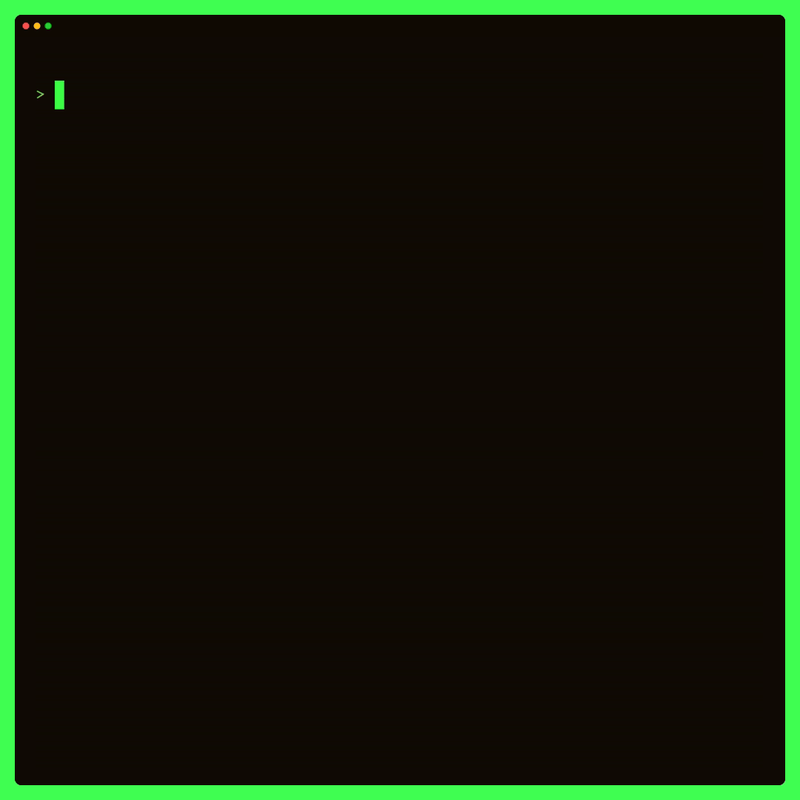

# Duplex (Model ⇋ Background Goroutine)

## How It Works

The system operates using two channels:

1. **Background Goroutine → Message Channel → Model**
2. **Background Goroutine ← Users Channel ← Model**

### Key Components
- **Model**:
    - Listens on the `MessageChannel`.
    - Sends updates to the `UsersChannel` when the selected user changes.

- **messageHandlerService (Background Goroutine)**:
    - Listens on the `UsersChannel`.
    - Adjusts message filtering based on the user selected in the TUI model.

This duplex communication ensures that as the selected user changes in the Model, the `MessageHandlerService` dynamically adjusts its behavior.
